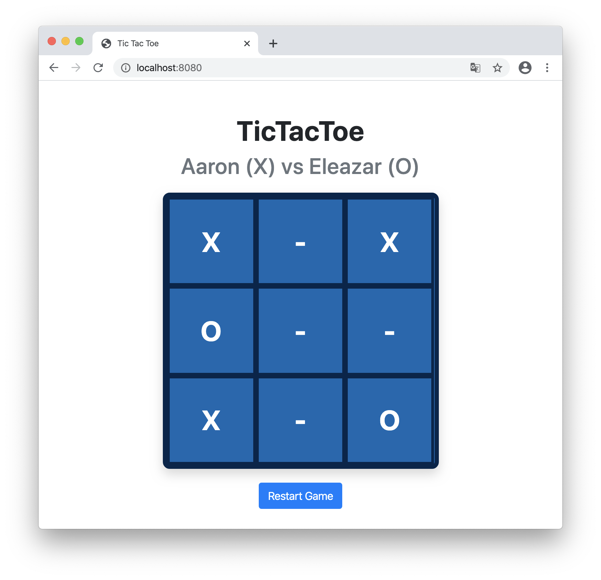

# js-tictactoe
A Tic-tac-toe game made in Javascript

## Live Link
Live Githack Link: https://raw.githack.com/elshaka/js-tictactoe/tictactoe/index.html

## Built With

- HTML, CSS, Bootstrap
- JavaScript

## Authors

👤 **Aaron Rory**

- Github: [@Aaron-RN](https://github.com/Aaron-RN)
- Twitter: [@ARNewbold](https://twitter.com/ARNewbold)
- Linkedin: [Aaron Newbold](https://www.linkedin.com/in/aaron-newbold-1b9233187/)

👤 **Eleazar Meza**

- Github: [@elshaka](https://github.com/elshaka)
- Twitter: [@elshaka](https://twitter.com/elshaka)
- Linkedin: [Eleazar Meza](https://www.linkedin.com/in/elshaka/)

## 🤝 Contributing

Contributions, issues and feature requests are welcome!

Feel free to check the [issues page](issues/).

## Show your support

Give a ⭐️ if you like this project!

## 📝 License

This project is [MIT](lic.url) licensed.
